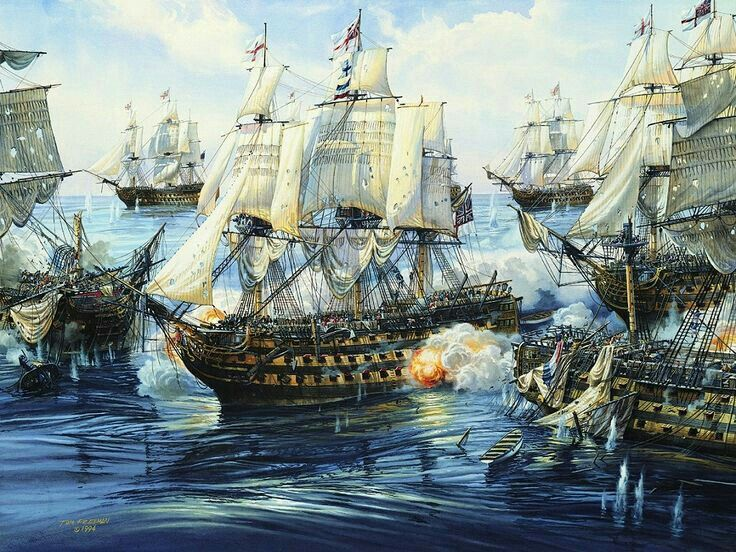

# Battleship

## Nickname do grupo - Chree

## Membros do grupo
| Nome | Nº | Curso |
|------|----|--------|
| Luísa Almas | 122978 | IGE |
| Pedro Soares | 122998 | IGE |
| Margarida Ribeiro | 124133 | IGE |

## Regras do Jogo 

O jogo da Batalha Naval é jogado entre dois jogadores, sendo que cada um possui duas grelhas quadradas de 10x10 posições. Uma grelha representa o seu próprio mar, onde são colocados os navios, e a outra representa o mar do adversário, onde são registados os tiros efetuados ao longo do jogo.

No início da partida, cada jogador posiciona secretamente a sua frota na sua grelha. Os navios podem ser colocados apenas na horizontal ou na vertical e não podem sobrepor-se nem tocar-se entre si, embora possam ficar encostados às bordas da grelha. Ambos os jogadores possuem exatamente o mesmo conjunto de navios.

Depois de posicionados os navios, os jogadores jogam alternadamente. Em cada turno, um jogador dispara três tiros indicando as coordenadas correspondentes à linha e coluna pretendidas. O adversário deve informar o resultado dos tiros, indicando quais acertaram em navios, o tipo de navio atingido e quais caíram na água. Cada jogador regista os resultados na grelha do adversário, assinalando acertos, falhas e navios afundados.

Um navio é considerado afundado quando todas as posições que ocupa forem atingidas. O jogo termina quando um dos jogadores conseguir afundar todos os navios da frota adversária, sendo esse jogador declarado vencedor.

## Tipos de Navios 

No jogo, os navios tradicionais da Batalha Naval são representados por embarcações equivalentes da época dos Descobrimentos Portugueses. Cada tipo de navio ocupa um número específico de posições no tabuleiro, definido pela sua dimensão.

| Navio (Jogo) | Equivalente Histórico | Nome em Inglês | Dimensão | Quantidade |
|--------------|----------------------|----------------|-----------|-------------|
| Porta-aviões | Galeão | Galleon | 5 | 1 |
| Navio de 4 canhões | Fragata | Frigate | 4 | 1 |
| Navio de 3 canhões | Nau | Carrack | 3 | 2 |
| Navio de 2 canhões | Caravela | Caravel | 2 | 3 |
| Submarino | Barca | Barge | 1 | 4 |

### Descrição dos Navios

- **Galeão** — Grande embarcação de guerra dos séculos XVI–XVII, fortemente armada e utilizada em viagens oceânicas longas. Representa o maior navio do jogo.
- **Fragata** — Navio rápido e versátil, usado para combate e escolta naval.
- **Nau** — Embarcação típica dos Descobrimentos Portugueses, usada no transporte de mercadorias e tripulações em viagens intercontinentais.
- **Caravela** — Navio leve e altamente manobrável, fundamental para a exploração marítima portuguesa.
- **Barca** — Pequena embarcação de apoio e transporte costeiro, representando o navio de menor dimensão.

## Resposta a perguntas da Ficha

### E.3 – Product Backlog (Requisitos Adicionais)

Como Product Owner da aplicação *Discoveries Battleship Game*, para além das regras básicas do jogo, foram identificados os seguintes requisitos adicionais para o Product Backlog:

- Criar e iniciar partidas entre dois jogadores.
- Permitir posicionamento manual ou automático dos navios, validando as regras do jogo.
- Realizar jogadas por turnos com três tiros por ronda.
- Indicar o resultado dos tiros (água, atingido ou navio afundado).
- Visualizar o tabuleiro próprio e o tabuleiro do adversário.
- Guardar o estado do jogo (ex.: em ficheiro JSON ou base de dados).
- Permitir retomar partidas interrompidas.
- Registar histórico e estatísticas de jogos dos jogadores.
- Possibilidade de jogar contra Inteligência Artificial com diferentes níveis de dificuldade.

O Product Backlog poderá evoluir ao longo do desenvolvimento, sendo priorizado de acordo com a metodologia Scrum.

---

### Parte 2 – C. Comparação crítica (Reflita)

O trabalho através da plataforma web do GitHub permite uma gestão simples do projeto, sendo mais adequado para criar e gerir Issues, rever código, acompanhar contribuições da equipa e realizar pequenas alterações em ficheiros como o README.

Por outro lado, o uso do IDE IntelliJ IDEA oferece um ambiente de desenvolvimento mais completo, facilitando a escrita e edição de código, debugging, gestão avançada de branches e geração automática de documentação, como o Javadoc.

Assim, a interface web é mais indicada para colaboração e gestão do projeto, enquanto o IDE é preferível para o desenvolvimento e implementação técnica do software.

## Referências Históricas

- https://pt.wikipedia.org/wiki/Gale%C3%A3o  
- https://pt.wikipedia.org/wiki/Caravela  
- https://pt.wikipedia.org/wiki/Nau  
- https://pt.wikipedia.org/wiki/Fragata  
- https://pt.wikipedia.org/wiki/Barca  

